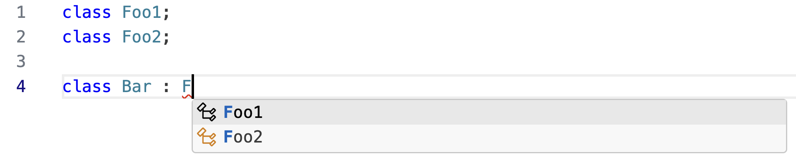
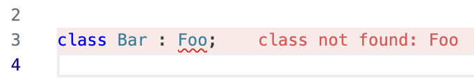
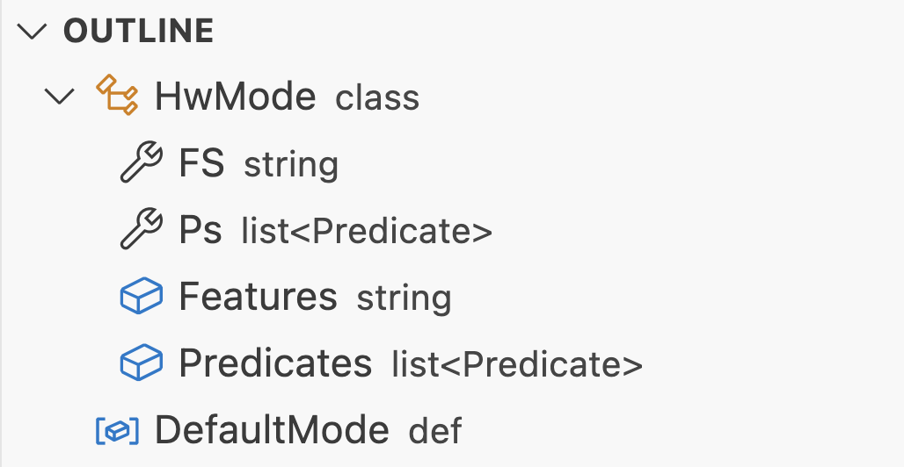
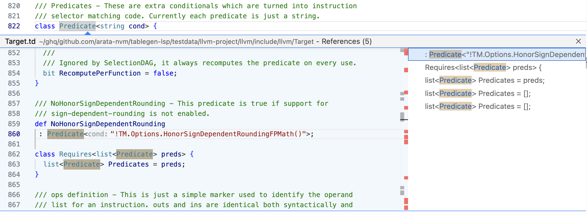
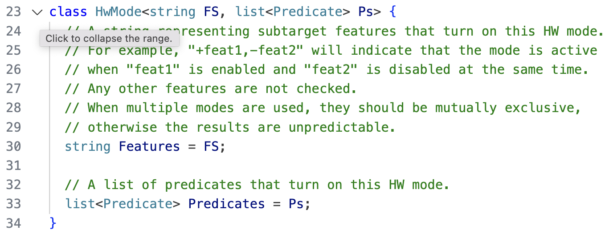
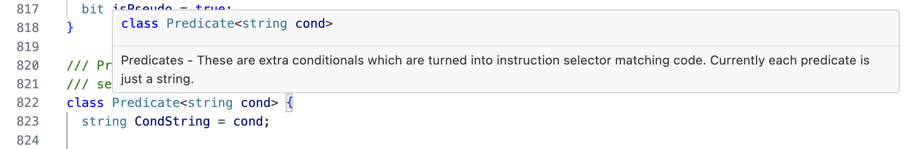
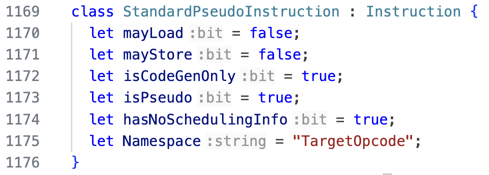
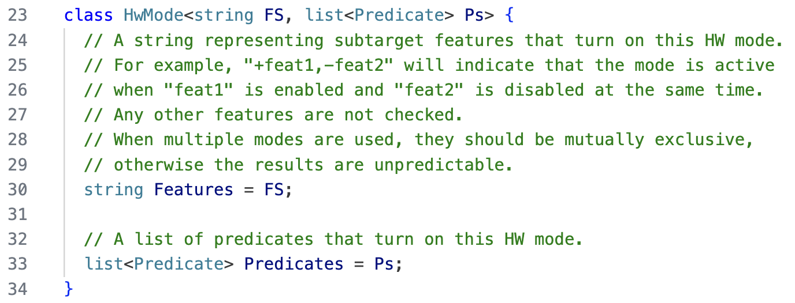
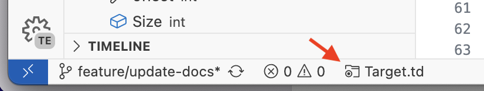

## LSP Features

### Completion

### Diagnostics

### Document Symbol

### Find References

### Folding

### Go to Definition

No screenshot available.

### Hover

### Inlay Hints

### Syntax Highlighting

## VS Code Extension Features

### Source Root

This is a feature to specify a file that serves as the root of TableGen source code (Source Root).
When a Source Root is specified, code evaluation starts from the Source Root file regardless of which file is currently open in the editor.

> [!NOTE]
> Only files that are included from the Source Root are evaluated. Files that are not included from the Source Root will not be evaluated, and LSP features will be disabled for them.

The Source Root can be set using the `Set Source Root` command and cleared using the `Clear Source Root` command. The currently set Source Root is displayed on the left side of the status bar as shown in the figure below. Clicking on the status bar display will open the Source Root in the editor.

