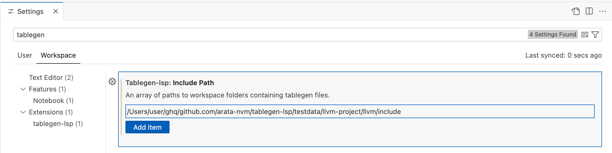
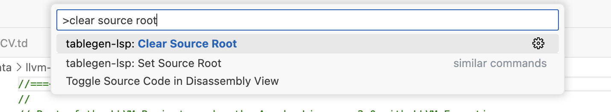

## Tutorial

This document explains how to use tablegen-lsp with VS Code.

### Install the VS Code Extension

Open VS Code and search for `tablegen-lsp` in the Extensions tab to install it.


### Open the LLVM Project

Clone LLVM locally and open it in VS Code.

```bash
git clone https://github.com/llvm/llvm-project.git
code llvm-project
```

Now, open the `llvm-project/llvm/lib/Target/RISCV/RISCV.td` file. You should see include errors displayed as follows:


### Configure Include Path

Open VS Code's settings and add `path/to/llvm-project/llvm/include` to `Tablegen-lsp: Include Path`.



Alternatively, add the following to your VS Code settings file `settings.json`:
```json
{
  "tablegen-lsp.includePaths": [
    "path/to/llvm-project/llvm/include",
  ]
}
```

You will then see a message prompting you to restart the language server.


After restarting, the include errors should be resolved as follows:


### Configure Root Source

When you open a file that is included in `llvm-project/llvm/lib/Target/RISCV/RISCV.td` (e.g., `RISCVFeatures.td`), you should see errors displayed as follows:


This is because the dependency on `llvm/Target/Target.td`, which is included from `RISCV.td`, is not being properly parsed. By configuring the Root Source, you can ensure parsing always starts from `RISCV.td`, resolving the errors.

There are two methods to configure the Source Root:

1. Open the Command Palette and execute "tablegen-lsp: Set Source Root".


2. Right-click the file and select "Set Source Root".


After setting the Source Root, the filename should appear in the status bar.


For testing, set `RISCV.td` as the Source Root and reopen `RISCVFeatures.td` - the errors should be resolved.


To clear the Source Root configuration, open the Command Palette and execute "tablegen-lsp: Clear Source Root".



### Using Features

Once configuration is complete, the following features become available:

- Go to Definition
  - Right-click > "Go to Definition"
- Find References
  - Right-click > "Go to References"
- Document Links
  - <kbd>Ctrl</kbd>(<kbd>Cmd</kbd>) + Click on a file that is included
- Inlay Hints
  - Displays type information for template arguments, fields, etc.
- Code Completion
  - Suggestions for class names, field names, etc.

For more features, please refer to [Features](./features.md).